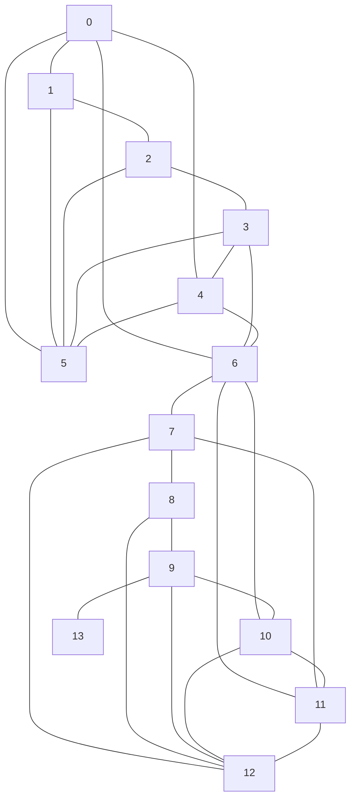

# SCAN: A Structural Clustering Algorithm for Networks

Javascript implementation of SCAN: a structural clustering algorithm for networks.

> Xiaowei Xu, Nurcan Yuruk, Zhidan Feng, and Thomas A. J. Schweiger. 2007. SCAN: a structural clustering algorithm for networks. In Proceedings of the 13th ACM SIGKDD international conference on Knowledge discovery and data mining (KDD '07). Association for Computing Machinery, New York, NY, USA, 824–833. [https://doi.org/10.1145/1281192.1281280](https://doi.org/10.1145/1281192.1281280)

PDF of Xiaowei Xu et al. paper and slides in `reading` folder. There is also an online talk at [videolectures.net](http://videolectures.net/kdd07_xu_scan/).

My code is crude, the Javascript is embedded in `index.html`, results shown in console, lots of tidying up to do. Makes heavy use of [cpettitt/graphlib](https://github.com/cpettitt/graphlib). Hope to package this along the lines of [Weighted cliques](https://linen-baseball.glitch.me).

The goal is to use this algorithm to implement something like:

> I. Hussain and S. Asghar, "LUCID: Author name disambiguation using graph Structural Clustering," 2017 Intelligent Systems Conference (IntelliSys), 2017, pp. 406-413, doi: 10.1109/IntelliSys.2017.8324326.

## Examples

The example for the original paper is `example.dot` which can be viewed at [dreampuf.github.io](https://dreampuf.github.io/GraphvizOnline).

